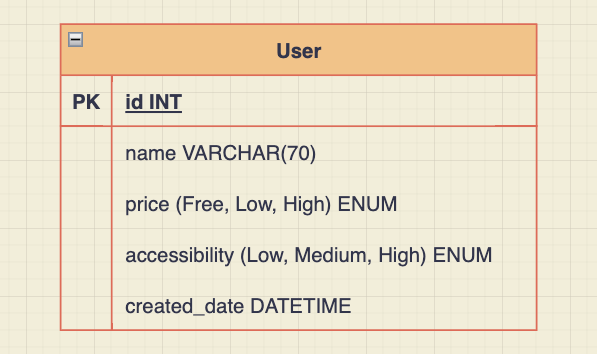

# Activity Suggestor

## API Overview

The primary motivation of the Activity Suggestor API is to provide suggestions for activities a person(s) might perform in the event they are bored.

All URLs in the reference documentation use the following base URL:

`http://localhost:3000/api`

## Getting Started

### Requirements

- [Docker](https://formulae.brew.sh/cask/docker)
- [Node](https://formulae.brew.sh/formula/node)
- [yarn](https://formulae.brew.sh/formula/yarn)

### Running the Stack

0. Navigate into /server directory

   ```bash
   cd server
   ```

1. **Bring up MySQL server**

   Start MySQL server running in Docker in the background exposed on port 3306

   ```bash
   docker compose up -d
   ```

2. **Configure MySQL schema**

   Apply the database migrations to the MySQL server

   ```bash
   yarn install && yarn migration:run
   ```

3. **Bring up Express server**

   Run Express server locally in dev mode exposed on port 3000

   ```bash
   yarn dev
   ```

### Shutdown Stack

1. **Kill Express Server**

   In the terminal running the express server, kill the server by pressing `ctrl + c`

2. **Kill Database**

   Kill MySQL server running inside Docker container managed by Docker Compose

   ```bash
   docker compose down
   ```

   To optionally remove the created Docker volume used by the MySQL server

   ```bash
   docker compose down -v
   ```

## API Resources

### Activity (`/activity`)

The **activity** resource is the primary resource of the API, representing a suggested activity a client might perform in the event they are bored. The activity object consists of a set of properties describing some relevant details about the activity suggested.

#### GET - Retrieving an activity

Request:

    - HTTP Method: GET
    - Query Parameters: N/A

Example Response:

    {
      "activity": "Learn Express.js",
      "accessibility": "High",
      "type": "education",
      "participants": 1,
      "price": "Low",
      "link": "https://expressjs.com/",
      "key": "3943506"
    }

where:

- **activity**: Description of the queried activity
- **accessibility**: A factor describing how possible an event is to do with "High" being the most accessible ["Low", "Medium", "High"]
- **type**: Type of activity ["education", "recreational", "social", "diy", "charity", "cooking", "relaxation", "music", "busywork"]
- **participants**: The number of people that this activity could involve [0, n]
- **price**: A factor describing the cost of the event ["Free", "Low", "High"]
- **link**: Relevant webpage links to learn more about the activity
- **key**: A unique numeric id

Note: Returns activity recommendation for the **latest** saved user. If none exist, response does not consider user profile in recommendation.

### User (`/user`)

A User profile is a representation of a user's preferences.

#### POST - Creating a User profile

Request:

    - HTTP Method: POST
    - Body:
      {
        "name": string,
        "accessibility": "Low" | "Medium" | "High",
        "price": "Free" | "Low" | "High"
      }

where:

- **name**: The user's name
- **accessibility**: Preferred level of accessibility ["Low", "Medium", "High"]
- **price**: Preferred pricing ["Free", "Low", "High"]

Example Response:

    {
      "id": 3304,
      "name": "Jimothy Shrute",
      "accessibility": "High",
      "price": "Free",
      "created_date": "2023-04-01T03:23:29.383Z"
    }

where:

- **id**: User's unique ID
- **created_at**: Datetime stamp in which the user entity was created (in ISO-8601 format)

## Database

Considering the current scope of this system, the data requiring storage can be organized in a single entity type. Choice of saving the data in a relational database rather than another database type (e.g. document database) was arbitrary under the current known scope. However, a relational database may be a good design choice as scope and therefore complexity grows.

### Entity Relationship Diagram



## Resources

- [Bored API](https://www.boredapi.com/)

## TODOs

With more time, the following needs to be worked on:

- Continue adding test coverage. API testing may be a good fit since the business logic is simple, but the end results sent to the client are really what matter
- Refactor file organization in test folder
- Create error objects for when Bored-API returns error
- Better error logging
- More thorough validations on client input
- Standardized error formatting thrown to client
- OpenAPI spec & Swagger UI
- Dockerize server & database and configure docker-compose stack
- Prep envs for production deployment
- Implement simple client-app to interact with the API
